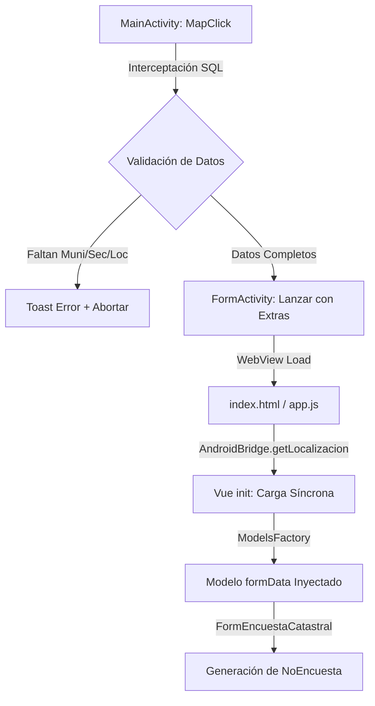

# Propagación de Datos Geográficos (De Mapa a Formulario)

Este documento describe el flujo técnico de los datos geográficos y cómo se garantiza su consistencia desde la interceptación en el mapa (**MainActivity.kt**) hasta la generación de IDs en la interfaz web (**Vue 3**).

## 🌍 Arquitectura del Flujo



## 🛡️ Fase 1: Blindaje en Android (`MainActivity.kt`)

Para evitar que lleguen datos vacíos a la interfaz, se aplica **Programación Defensiva** en el evento `setOnMapClickListener`:

1.  **Interceptación de Predio**: Se busca en la tabla `objects` layer `Predios`.
2.  **Identificación Administrativa**: Se buscan los polígonos de `Municipios` y `Sectores`.
3.  **Valla de Control**:
    ```kotlin
    if (mun.isNullOrEmpty() || sec.isNullOrEmpty() || geom.localizacion.isNullOrEmpty()) {
        Toast.makeText(this, "⚠️ Error: Ubicación geográfica incompleta", Toast.LENGTH_LONG).show()
        return@setOnMapClickListener
    }
    ```
4.  **Transporte de Extras**: Se pasan como extras del `Intent` para que estén listos antes de que el WebView se cargue. Esto incluye tanto la creación como la **Edición** (`openFormActivityForEdit`).

## 🏢 Fase 2: Consolidación en el Despacho (`app.js`)

La función `init()` en la aplicación Vue es el "Aduana" de los datos.

1.  **Carga Prioritaria**: Se obtienen todos los valores del `AndroidBridge` de forma síncrona en el `onMounted`.
2.  **Reproyección UTM**: Se calculan las coordenadas X e Y (EPSG:32616) inmediatamente para su visualización en el `index.html`.
3.  **Inyección en el Modelo**: El `resetForm` inyecta la localización **dentro** del objeto `formData`. 
    -   *Anteriormente*: La localización era una `prop` externa, lo que generaba errores de sincronización (Race Conditions).
    -   *Ahora*: El modelo "nace" con la localización, el municipio y el sector ya incrustados.

## 📝 Fase 3: Generación del ID de Encuesta (`FormEncuestaCatastral.js`)

El campo `NoEncuesta` es una composición de los tres pilares geográficos + un consecutivo.

*   **Composición**: `${muni}_${sector}_${localizacion}_${consecutivo}`
*   **Garantía**: Al leer el valor de `formData.Localizacion` (inyectado en Fase 2), el componente garantiza que el ID siempre reflejará el predio real interceptado, eliminando el fallo histórico que mostraba `SIN_LOC`.

## 🧹 Mitigación de Campos Fantasma

Como parte de este proceso de limpieza, se eliminó el campo **`ResidenceDepartamento`**.
*   **Razón**: El sistema ya tiene el código de municipio (`CodMuni`). 
*   **Lógica**: Los dos primeros dígitos del código de municipio representan el departamento. El componente `CatalogoSelectorTwoLevels.js` se encarga de mostrar el nombre del departamento visualmente sin necesidad de almacenar una propiedad redundante en el DTO o en la base de datos.

## 📡 Fase 4: Persistencia y Metadatos (`SyncService`)

El ciclo de vida del dato se cierra con el servicio de sincronización centralizada:

1.  **Enriquecimiento Automático**: Al invocar `SyncService.saveData()`, el sistema inyecta en el JSON final los metadatos de auditoría (`Fecha`, `Encuestador`) y de ubicación (`LatLng`, `LocalProj`, `IdObject`, `Localizacion`) sin que el componente Vue tenga que gestionarlos manualmente.
2.  **Corrección Técnica de UTM**: Garantiza que el objeto `LocalProj` use las propiedades `East` (UTM X) y `North` (UTM Y) con la PascalCase exacta requerida por el backend de C# en el motor de persistencia.
3.  **Transaccionalidad de Imágenes**: Coordina con `PhotoService` para que el campo `Imagenes` del JSON refleje exactamente las fotos que han sobrevivido al proceso de borrado físico en el disco.

