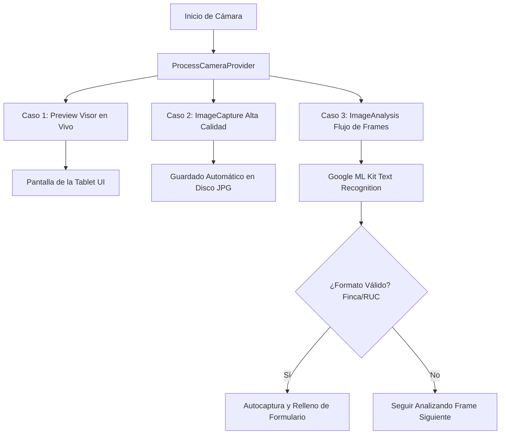

# Diseño Técnico: Cámara Integrada (CameraX) y Plataforma OCR (Google ML Kit)

Este documento detalla la arquitectura, requerimientos y hoja de ruta para reemplazar la delegación de cámara por una **Cámara In-App (dentro de la aplicación)** utilizando **Android CameraX**. Este diseño tiene el doble propósito de automatizar la captura de fotos de fachadas con máxima calidad y estabilización, y servir de base para el reconocimiento de texto (OCR) en documentos catastrales sin requerir conexión a Internet.

---

## 1. Arquitectura del Sistema (Flujo en Vivo)

El siguiente diagrama ilustra cómo CameraX maneja los casos de uso en paralelo para el visor en vivo, la captura de imágenes en alta resolución y el análisis de texto en tiempo real para el OCR:



---

## 2. Dependencias de Gradle (`build.gradle`)

Para implementar esta arquitectura, se deben agregar las siguientes dependencias oficiales al proyecto:

```groovy
dependencies {
    // Librerías Core de CameraX
    def camerax_version = "1.3.1"
    implementation "androidx.camera:camera-core:${camerax_version}"
    implementation "androidx.camera:camera-camera2:${camerax_version}"
    implementation "androidx.camera:camera-lifecycle:${camerax_version}"
    implementation "androidx.camera:camera-view:${camerax_version}"

    // Google ML Kit Text Recognition (Modelo empaquetado para uso 100% offline)
    implementation 'com.google.mlkit:text-recognition:16.0.0'
}
```

---

## 3. Características de Usabilidad y Automatización

Para que el encuestador pase el menor trabajo posible bajo el sol cargando el dispositivo, el visor de la cámara integrada incluirá:

* **Estabilización de imagen digital/óptica**: Habilitada automáticamente mediante los metadatos de configuración de `Camera2CameraControl` si el hardware de la tablet Samsung Active 8 Pro lo soporta.
* **Retícula / Guía de fachada**: Una cuadrícula de 3x3 semitransparente dibujada sobre el visor para ayudar a alinear las líneas verticales de las casas y evitar fotos con distorsión de perspectiva.
* **Autoenfoque continuo (CAF)** y **Enfoque manual por toque**: La cámara enfocará automáticamente al centro de forma constante. Tocar cualquier zona de la pantalla forzará el enfoque y recalculará la exposición de luz en esa área (útil para contrastes fuertes de sol y sombra).
* **Control de flash automático**: Detección del nivel de luz ambiental para disparar el flash de asistencia si la fachada está a contraluz o en sombra profunda.

---

## 4. Hoja de Ruta para Integración de OCR (ML Kit Offline)

Para el reconocimiento de texto en documentos sin requerir internet, la cámara integrada servirá de plataforma para procesar el flujo de frames de la siguiente manera:

1. **Visor con Área de Interés (ROI)**: Se dibujará un recuadro blanco translúcido en el centro de la pantalla indicando al encuestador dónde colocar el código de barra, número de finca o RUC del documento.
2. **Caso de Uso `ImageAnalysis`**:
   * CameraX capturará frames de resolución reducida (ej: 1280x720) para optimizar el rendimiento y los enviará a un analizador.
   * Se convertirá el frame de la cámara al formato `InputImage` requerido por ML Kit.
3. **Procesamiento del Texto**:
   * El reconocedor local de ML Kit extraerá las cadenas de texto del área de interés.
   * Un algoritmo de **Expresiones Regulares (Regex)** en Kotlin validará si el texto coincide con el patrón esperado:
     * *RUC*: `^[J|N|M|G]\d{13}[A-Z]$` (Ejemplo de patrón en Nicaragua).
     * *Número de Finca*: Patrón puramente numérico.
4. **Vibración y Retorno**: Al coincidir con un patrón válido, el dispositivo vibrará brevemente como confirmación física para el encuestador, cerrará la cámara y rellenará el input correspondiente en la ficha automáticamente.
